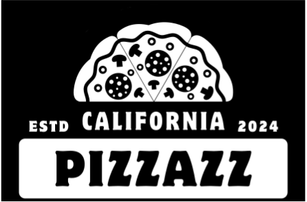

<p align="center">
  <a href="https://github.com/j4ke-exe/Senior-Project">
    
  </a>
</p>

<h3 align="center">
  Point-of-Sale - Online Food Ordering System
</h3>

<p align="center">
  <a href="https://github.com/j4ke-exe/Senior-Project"><strong>Explore Documents</strong></a>
</p>

<p align="center">
   
  
</p>

## Preview


## Built With

Flask, JavaScript, HTML, and CSS.

## Installation

1. Clone the repo

```sh
git clone https://github.com/j4ke-exe/Senior-Project.git
```

2. Install requirements

```sh
pip install -r requirements.txt
```

## Project Team

* **Nadiyah Glenn-Bracey** - *Product Owner*
* **Papitchaya Deehamhae** - *Scrum Master*
* **Jacob Garrison** - *Development Team*
* **Jared McLeod** - *Development Team*
